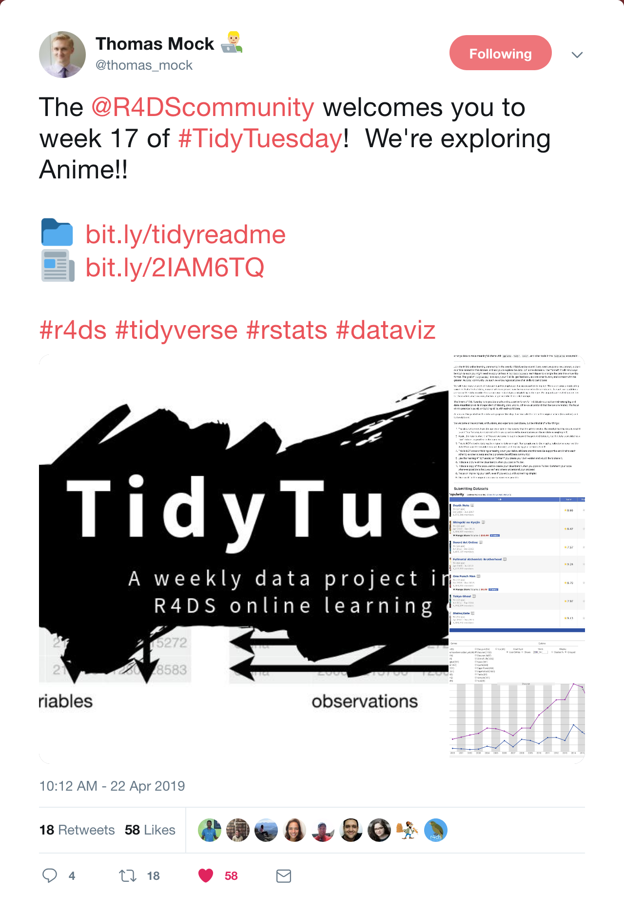
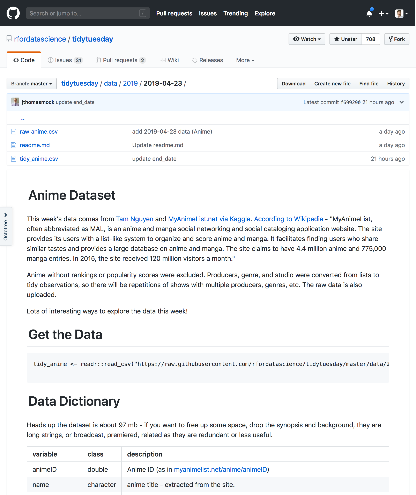
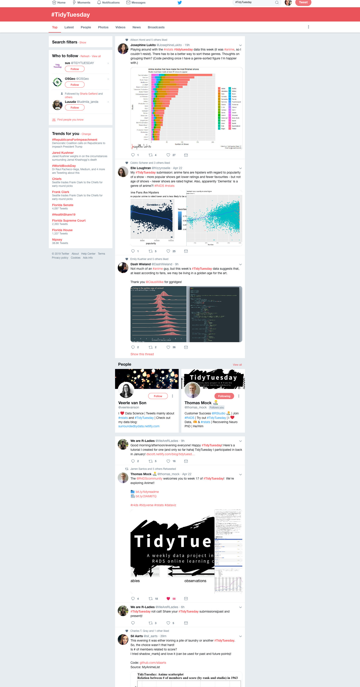
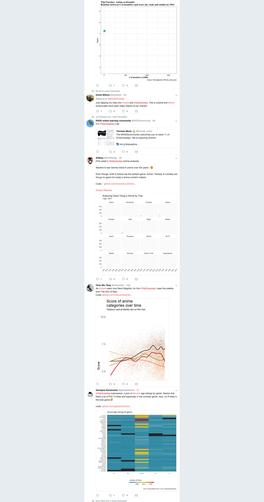
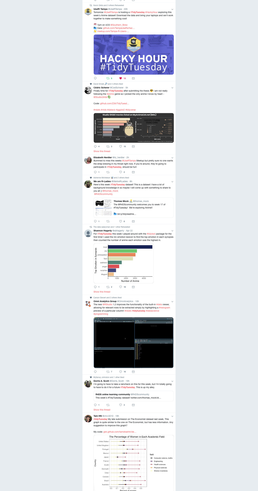

```{r setup, include=FALSE}
options(htmltools.dir.version = FALSE)
```

```{r xaringanthemer, include=FALSE}
library(xaringanthemer)
style_duo_accent(
  primary_color = "#5B5FCA",
  secondary_color = "#D98C4A",
  text_font_google = google_font("Roboto"),
  header_font_google = google_font("Trade Winds"),
  code_font_google = google_font("Fira Mono"),
  text_font_size = "24px",
  header_h1_font_size = "60px",
  header_h2_font_size = "50px",
  header_h3_font_size = "40px",
  title_slide_background_image = "https://raw.githubusercontent.com/TampaUseRs/TampaUseRs/master/assets/hex-logo/trug-hex-800.png",
  title_slide_background_size = "33%",
  title_slide_background_position = "80% 50%",
  extra_css = list(
    ".mh-560 img" = list(
      "max-height" = "560px"
    ),
    ".huge p, .huge li" = list(
      "font-size" = "1.25em"
    ),
    ".scroll-y" = list(
      "max-height" = "75%",
      "overflow-y" = "scroll"
    ),
    ".big" = list("font-size" = "2em")
  )
)
```

class: inverse center middle

# What is #TidyTuesday?

---

class: middle

.pull-left.mh-560[

]

.pull-right[
<p style="padding-top: 8em"></p>
## r4ds.had.co.nz
]


---

class: center top
background-image: url(https://raw.githubusercontent.com/rfordatascience/tidytuesday/master/static/tt_logo.png)

### github.com/rfordatascience/tidytuesday

---

.pull-left.mh-560[

]

--

.pull-right.mh-560[

]

---

class: center middle

### #TidyTuesday

.mh-560[

 

]

---

### nsgrantham.shinyapps.io/tidytuesdayrocks

<div style="width: 100%; max-height: 80%">
<iframe width="100%" style="position: absolute; height: 100%; border: none" src="https://nsgrantham.shinyapps.io/tidytuesdayrocks/"></iframe>
</div>

---

class: inverse center middle

# Meet Our Data

---

background-image: url(images/tt-anime.jpg)
background-size: cover
background-position: top left

---

class: huge

## How To Get The Data


1. <https://github.com/TampaUseRs/hacky-hour-april-2019>

2. <https://rstudio.cloud/project/323454>

3. &#x1F64B;&#x200D;&#x2642;&#xFE0F; See Garrick for &#x1F4BE;

---

## tidytuesday_anime.R

```r
library(tidyverse)

anime <- read_csv("data/tidy_anime.csv")
```

---

## Data Dictionary

.scroll-y[

|variable       |class     |description |
|:--------------|:---------|:-----------|
|animeID        |double    | Anime ID (as in https://myanimelist.net/anime/animeID)          |
|name           |character |anime title - extracted from the site.           |
|title_english  |character | title in English (sometimes is different, sometimes is missing)          |
|title_japanese |character | title in Japanese (if Anime is Chinese or Korean, the title, if available, in the respective language)          |
|title_synonyms |character | other variants of the title         |
|type           |character | anime type (e.g. TV, Movie, OVA)          |
|source         |character | source of anime (i.e original, manga, game, music, visual novel etc.)         |
|producers      |character | producers          |
|genre          |character | genre         |
|studio         |character | studio           |
|episodes       |double    | number of episodes           |
|status         |character | Aired or not aired      |
|airing         |logical   | True/False is still airing          |
|start_date     |double    | Start date (ymd)        |
|end_date       |double    | End date (ymd)        |
|duration       |character | Per episode duration or entire duration, text string        |
|rating         |character | Age rating         |
|score          |double    | Score (higher = better)       |
|scored_by      |double    | Number of users that scored          |
|rank           |double    | Rank - weight according to MyAnimeList formula          |
|popularity     |double    |  based on how many members/users have the respective anime in their list          |
|members        |double    | number members that added this anime in their list         |
|favorites      |double    | number members that favorites these in their list          |
|synopsis       |character | long string with anime synopsis          |
|background     |character | long string with production background and other things          |
|premiered      |character | anime premiered on season/year          |
|broadcast      |character | when is (regularly) broadcasted         |
|related        |character | dictionary: related animes, series, games etc.         |

]

---

class: center middle inverse

# Human K-Means Clustering

---
class: huge middle center
layout: true
---

.pull-left.big[
**Tidyverse**

.big[&#x1F448;&#x1F3FC;]
]

.pull-right.big[
**Base R**

.big[&#x1F449;&#x1F3FC;]
]

---

.pull-left.big[
`ggplot()`

.big[&#x1F446;&#x1F3FC;]
]

.pull-right.big[
`par(mfrow = 2)`

.big[&#x1F447;&#x1F3FC;]
]

---

.pull-left.big[
**spaces**

.big[&#x1F448;&#x1F3FC;]
]

.pull-right.big[
**tabs**

.big[&#x1F449;&#x1F3FC;]
]

---

.pull-left.big[
**static**

.big[&#x1F446;&#x1F3FC;]
]

.pull-right.big[
**animated**

.big[&#x1F447;&#x1F3FC;]
]

---

.pull-left.big[
**data cleaning**

.big[&#x1F448;&#x1F3FC;]
]

.pull-right.big[
**data viz**

.big[&#x1F449;&#x1F3FC;]
]

---

.pull-left.big[
**data viz**

.big[&#x1F446;&#x1F3FC;]
]

.pull-right.big[
**modeling**

.big[&#x1F447;&#x1F3FC;]
]

---
background-image: url(https://media.giphy.com/media/dvgefaMHmaN2g/giphy.gif)
background-size: cover
---


.pull-left.big[
**new to R**

.big[&#x1F448;&#x1F3FC;]
]

.pull-right.big[
**old to R**

.big[&#x1F449;&#x1F3FC;]
]

---

.pull-left.big[
**Want to Teach**

.big[&#x1F446;&#x1F3FC;]
]

.pull-right.big[
**Want to Learn**

.big[&#x1F447;&#x1F3FC;]
]


---

.pull-left.big[
**R**

&nbsp;
]

.pull-right.big[
**Python**

&nbsp;
]

---

.pull-left.big[
**R**

.big[&#x1F37B;]
]

.pull-right.big[
**Python**

.big[&#x1F3C3;&#x1F3FD;&#x1F4A8;]
]

---
layout: false
class: inverse center middle

# Clustering Process

---

class: huge

# Have Fun!

1. Yellow Post-It if you need help

1. We have `ggplot2` cheat sheets!

1. Tweet your creations to [&commat;UseRTampa](https://twitter.com/UseRTampa)  or [#TidyTuesday](https://twitter.com/hashtag/TidyTuesday)
